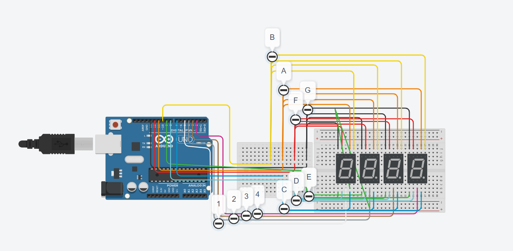

# Ascii-Ve-Binary-Uygulamas-
Girilen harfin ascii ve binari numarasını veren arduino uygulamasıdır.
Çalışan proje şu an rasgele sayıların ve yazıların assci ve binary numarasını vermektedir.
## Devre şeması şu şekilde

#License
[MIT License](./LICENSE)
